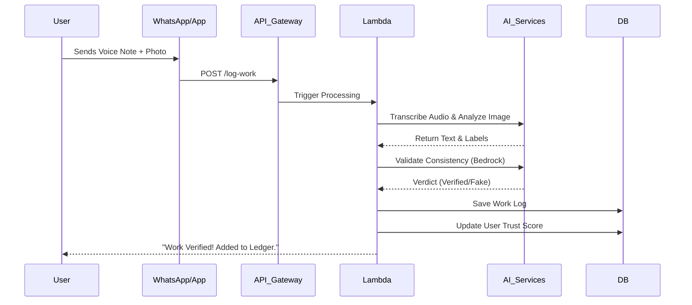

# System Design & Architecture: Pehchaan

## 1. High-Level Architecture
Pehchaan follows a **Serverless Event-Driven Architecture** hosted on AWS. This ensures low maintenance costs and automatic scaling. The frontend interacts via a lightweight PWA or WhatsApp interface, communicating with a backend orchestrated by AWS Lambda.

## 2. Tech Stack
* **Frontend:** React (PWA) or WhatsApp Business API (Twilio integration).
* **API Gateway:** AWS API Gateway (REST).
* **Compute:** AWS Lambda (Node.js/Python).
* **Database:** Amazon DynamoDB (NoSQL).
* **Object Storage:** Amazon S3 (Images/Audio logs).
* **AI Services:**
  * **ASR:** Amazon Transcribe (Speech-to-Text).
  * **Vision:** Amazon Rekognition (Object Detection).
  * **LLM/Logic:** Amazon Bedrock (Claude 3 Sonnet for reasoning).

## 3. System Components

### 3.1. The Ingestion Layer
1. User captures Audio + Image.
2. Data is sent via API POST request to `AWS API Gateway`.
3. Payload includes: `{ userId, timestamp, audioBlob, imageBlob, geolocation }`.

### 3.2. The Processing Layer (Lambda Orchestrator)
1. **Step 1: Save Media.** Save blobs to **S3 Buckets** (`/raw-audio`, `/raw-images`).
2. **Step 2: Transcribe.** Trigger **Amazon Transcribe** on the audio file.
   * *Output:* "I fixed the AC unit at Sector 4."
3. **Step 3: Analyze Image.** Trigger **Amazon Rekognition** on the image.
   * *Output Labels:* ["Air Conditioner", "Tools", "Repair", "Man"].
4. **Step 4: Logic Check.** Send Transcript + Image Labels to **Amazon Bedrock**.
   * *Prompt:* "User claims: '{transcript}'. Image contains: '{labels}'. Is this consistent? Return JSON { verified: boolean, confidence: score }."

### 3.3. The Data Layer (DynamoDB Schema)

**Table: Users**
* `PK`: UserID
* `Attributes`: Name, LanguagePref, TrustScore, MemberSince

**Table: WorkLogs**
* `PK`: LogID
* `SK`: UserID
* `Attributes`:
  * `Timestamp`: ISO Date
  * `Transcript`: String
  * `ImageS3Url`: String
  * `Status`: "Verified" | "Flagged" | "Pending"
  * `EstimatedValue`: Number
  * `Tags`: [List of skills extracted]

## 4. Data Flow Diagram (Sequence)

